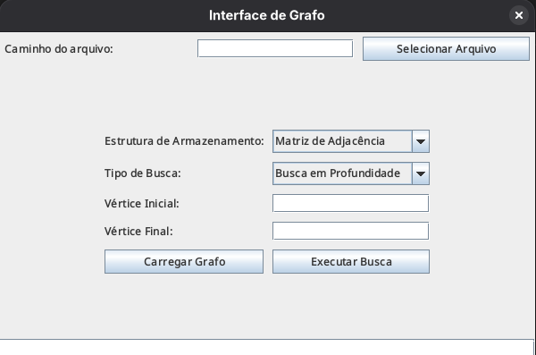
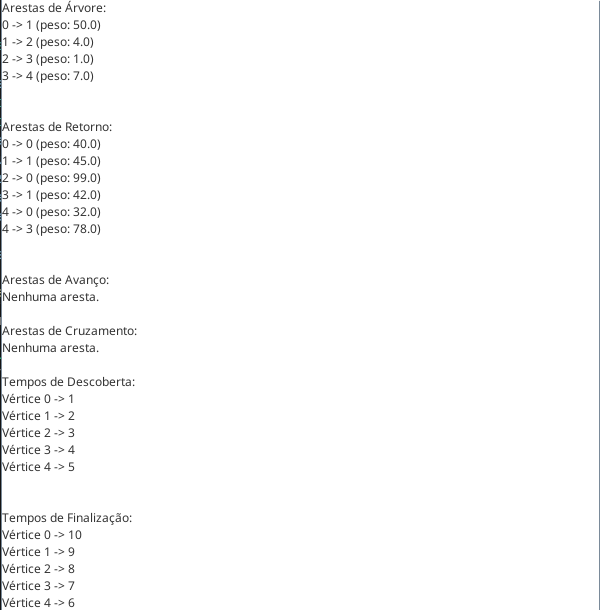

# Busca em grafo #


> O objetivo deste projeto é fornecer uma implementação prática das principais estruturas de dados e algoritmos estudados na teoria dos grafos. O sistema permite representar grafos de três formas distintas e executar algoritmos complexos para análise de conectividade e otimização.

<div align="center">
  <table>
    <tr>
      <td align="center">
        
        <br>
        <sub><b>Menu Inicial</b></sub>
      </td>
      <td align="center">
        
        <br>
        <sub><b>Aplicação rodando</b></sub>
      </td>
    </tr>
  </table>
</div>

## Sobre o Projeto

O projeto suporta três tipos de estruturas para armazenar o grafo, todas implementando uma interface comum.

### Representação de grafos

* **Lista de Adjacência**
* **Matriz de Adjacência**
* **Matriz de Incidência**

### Algoritmos implementados

* **Busca em Largura (BFS)**
* **Busca em Profundidade (DFS)**
* **Caminho Mínimo (Dijkstra)**
* **Árvore Geradora Mínima (AGM)**

## Ferramentas Utilizadas

- Java
- Estruturas de Dados: HashMap, ArrayList, PriorityQueue, LinkedList.

## Executando o Projeto

Siga as instruções abaixo para executar o projeto em seu ambiente local:

1. **Clone o repositório:**

   ```
   git clone https://github.com/Hyocas/busca-em-grafos.git
   ```

2. **Navegue até o diretório do projeto:**

   ```
   cd busca-em-grafos/src
   ```

3. **Compile os arquivos:**

   ```
   javac *.java
   ```

4. **Execute o arquivo:**

   ```
   java GrafoInterface
   ```

## Autor

- Leandro Balbino